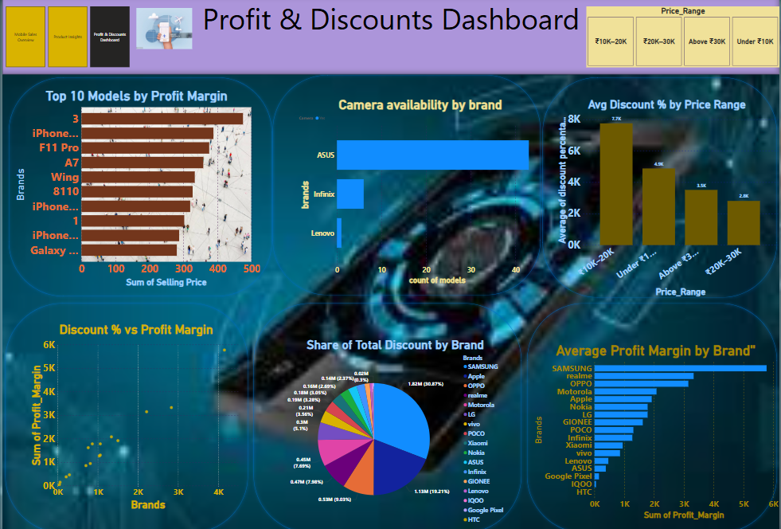
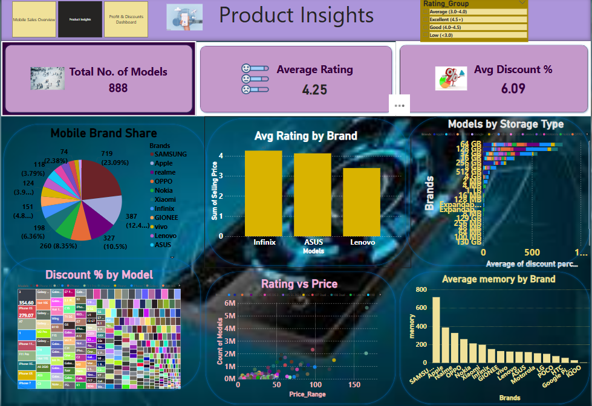

# 📱 Mobile Sales Dashboard (Power BI)

This is a 3-page professional Power BI dashboard analyzing mobile phone sales across brands and models. It covers revenue, discount strategy, product ratings, storage trends, and profit margin patterns.

 ## 📊 Dashboard Overview

### Page 1: Mobile Sales Overview
- Revenue by brand and models
- Discount trends and profit margin
- Cards for KPIs like total sales, average rating

### Page 2: Product Insights
- Brand share, rating patterns, memory & storage
- Rating vs price scatter
- Cards for average discount, model count

### Page 3: Profit & Discount Dashboard
- Profit margin by brand & model
- Discount trends across price ranges
- Camera analysis vs profitability

## 📷 Dashboard Screenshots

### 🔹 Page 1 – Mobile Sales Overview

### 🔹 Page 2 – Product Insights

### 🔹 Page 3 – Profit & Discounts

## 🛠️ Tools Used

- Power BI for dashboard design
- Power Query,jupyter notebook(python) for data cleaning
- GitHub for version control
- Excel / CSV for initial dataset formatting

## 📎 Dataset

- File: `mobilesalesdataset.csv`
- Contains details like:
  - Brands, Models, Ratings, Price, Storage, Memory, Camera
- Cleaned and transformed in Power BI

## 💼 Project Highlights

- Demonstrates DAX, visuals, slicers, and multi-page reporting
- Real-world sales data scenario

